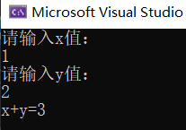

# 1. 句法
## 1.1. cin&&cout
C++ 中的输入与输出可以看做是一连串的数据流，输入即可视为从文件或键盘中输入程序中的一串数据流，而输出则可以视为从程序中输出一连串的数据流到显示屏或文件中。
```c++
#include <iostream>
using namespace std;
int Add(int x,int y){
    return x+y;
}
int main(){
    int x,y,z;
    cout<<"请输入x值："<<endl;
    cin>>x;
    cout<<"请输入y值："<<endl;
    cin>>y;
    z=Add(x,y);
    cout<<"x+y="<<z<<endl;
}
```


## 1.2. bool类型
在cpp中bool类型以旧和c中一样，返回0和1，占一个字节；
```c++
int main(){
    bool flag;
    int a,b;
    flag=a>b;
    cout<<"flag="<<flag<<endl;
}
```
输入3，4；flag=0；
输入3，2，flag=1；
也可以定义flag为false或true；
```c++
int main(){
    bool flag = true;
    if(flag){
        cout<<"true"<<endl;
    }else{
        cout<<"false"<<endl;
    }
    flag = false;
    if(flag){
        cout<<"true"<<endl;
    }else{
        cout<<"false"<<endl;
    }
    return 0;
}
```
输出true，false；
## 1.3. new&&delete
```c++
int *p=new int;//分配一个int型的内存空间
int *m=new int[10];//动态分配
delete p;//释放内存
delete[] m;
```
和 malloc() 一样，new 也是在堆区分配内存，必须手动释放，否则只能等到程序运行结束由操作系统回收。为了避免内存泄露，通常 new 和 delete、new[] 和 delete[] 操作符应该成对出现，并且不要和C语言中 malloc()、free() 一起混用。
## 1.4. inline内联函数
为了消除函数调用的时空开销，C++ 提供一种提高效率的方法，即在编译时将函数调用处用函数体替换，类似于C语言中的宏展开。这种在函数调用处直接嵌入函数体的函数称为内联函数（Inline Function），又称内嵌函数或者内置函数。

指定内联函数的方法很简单，只需要在函数定义处增加 inline 关键字。请看下面的例子：
```c++
#include <iostream>
using namespace std;
inline void swap(int *a,int *b){//函数定义
    int temp;
    temp=*a;
    *a=*b;
    *b=temp;
}
int main(){
    int m,n;
    cin>>m>>n;
    cout<<m<<","<<n<<endl;
    swap(&m,&n);//函数声明；
    cout<<m<<","<<n<<endl;
    return 0；
}
```
输入2，3输出3，2；
只能在函数定义出添加inline，函数声明出无效，当函数比较复杂时，函数调用的时空开销可以忽略，大部分的 CPU 时间都会花费在执行函数体代码上，所以我们一般是将非常短小的函数声明为内联函数。
## 1.5. c++函数重载
有时候我们需要实现几个功能类似的函数，只是有些细节不同。例如希望交换两个变量的值，这两个变量有多种类型，在C语言中，程序员往往需要分别设计出三个不同名的函数，其函数原型与下面类似；
```c++
void swap1(int *a, int *b);      //交换 int 变量的值
void swap2(float *a, float *b);  //交换 float 变量的值
void swap3(char *a, char *b);    //交换 char 变量的值
void swap4(bool *a, bool *b);    //交换 bool 变量的值
```
C++ 允许多个函数拥有相同的名字，只要它们的参数列表不同就可以，这就是函数的重载（Function Overloading）。借助重载，一个函数名可以有多种用途。
```c++
void swap(int *a,int *b){
    int temp;
    temp=*a;
    *a=*b;
    *b=temp;
}
void swap(float *a,float *b){
    int temp;
    temp=*a;
    *a=*b;
    *b=temp;
}
void swap(char *a,char *b){
    int temp;
    temp=*a;
    *a=*b;
    *b=temp;
}
void swap(bool *a,bool *b){
    int temp;
    temp=*a;
    *a=*b;
    *b=temp;
}
int main(){
    int m1=1,n1=2;
    float m2=1.0,n2=2.3;
    char m3='a,'n4='b';
    bool m4=true,n4=false;
    cout<<m1<<","<<n1<<endl;
    swap(m1,n1);
    cout<<m1<<","<<n1<<endl;
    cout<<m1<<","<<n1<<endl;
    swap(m2,n2);
    cout<<m2<<","<<n2<<endl;
    cout<<m2<<","<<n2<<endl;
    swap(m3,n3);
    cout<<m3<<","<<n3<<endl;
    cout<<m3<<","<<n3<<endl;
    swap(m4,n4);
    cout<<m4<<","<<n4<<endl;
}
```
==参数列表又叫参数签名，包括参数的类型、参数的个数和参数的顺序，只要有一个不同就叫做参数列表不同。==
### 1.5.1. c++是如何做到重载的？
C++代码在编译时会根据参数列表对函数进行重命名，例如void Swap(int a, int b)会被重命名为_Swap_int_int，void Swap(float x, float y)会被重命名为_Swap_float_float。当发生函数调用时，编译器会根据传入的实参去逐个匹配，以选择对应的函数，如果匹配失败，编译器就会报错，这叫做重载决议（Overload Resolution）。
## 类的定义
类是用户自定义的类型，如果程序中要用到类，必须提前说明，或者使用已存在的类（别人写好的类、标准库中的类等），C++语法本身并不提供现成的类的名称、结构和内容。
```c++
class Student{
    public:
    //成员变量
    char *name;
    char *sex;
    int age;
    float score;

    void say(){
        cout<<name<<"的年龄为"<<age<<endl;
    }
};
int main(){
    Student stu;
    stu.name='Wangxin';
    stu.age=22;
    stu.say()
    return 0;
}
Student Lilei;//创建对象
class Student Wangxin;//同样是创建对象
Student stu[100];//创建100个对象；该语句创建了一个 allStu 数组，它拥有100个元素，每个元素都是 Student 类型的对象。
```
分号表示一个类已经结束，Student类包含4个成员变量和一个成员函数
### 使用对象指针
上面代码中创建的对象 stu 在栈上分配内存，需要使用&获取它的地址，例如：
```c++
Student stu;
Student *pStu=&stu;
Student *qStu=new Student;
```
在栈上创建出来的对象都有一个名字，比如Wangxin，使用指针指向它不是必须的。但是通过 new 创建出来的对象就不一样了，它在堆上分配内存，没有名字，只能得到一个指向它的指针，所以必须使用一个指针变量来接收这个指针，否则以后再也无法找到这个对象了，更没有办法使用它。==也就是说，使用 new 在堆上创建出来的对象是匿名的，没法直接使用，必须要用一个指针指向它，再借助指针来访问它的成员变量或成员函数。==
有了对象指针后，可以通过箭头->来访问对象的成员变量和成员函数，这和通过结构体指针来访问它的成员类似，请看下面的示例：
```c++
pStu->name="王欣"；
pStu->age=22;
pStu->say();
```
==也可以把成员函数放外面，在类体中和类体外定义成员函数是有区别的：在类体中定义的成员函数会自动成为内联函数，在类体外定义的不会。==
```c++
void Student::say(){
    cout<<name<<"的年龄是"<<age<<"，成绩是"<<score<<endl;
}
inline void Student::say(){//内联函数；
    cout<<name<<"的年龄是"<<age<<"，成绩是"<<score<<endl;
}
```
## 类的访问权限
==类外只能访问public，类内public，protect，private可以互相访问==
```c++
#include <iostream>
using namespace std;
class Student{
    private:
    char *name;
    int age;
    float score;
    public:
    void setname(char *name);
    void setage(int age);
    void setscore(float score);
    void show();
}
//成员函数的定义
void Student::setname(char *name){
    m_name=name;
}
void Student::setage(int age){
    m_age = age;
}
void Student::setscore(float score){
    m_score = score;
}
void Student::show(){
    cout<<m_name<<"的年龄是"<<m_age<<"，成绩是"<<m_score<<endl;
}
int main(){
    //在栈上创建对象
    Student stu;
    stu.setname("王欣")；
    stu.setage(22);
    stu.setscore(92.5);
    stu.show();
    //在堆上建立对象
    Student *pStu=new Student;
    pStu->setname("梨花")；
    pStu->setage(22);
    pStu->setscore(92.3);
    pStu->show();
    return 0;
}
```
==成员变量大都以m_开头，这是约定成俗的写法，不是语法规定的内容。以m_开头既可以一眼看出这是成员变量，又可以和成员函数中的形参名字区分开==
## c++构造函数